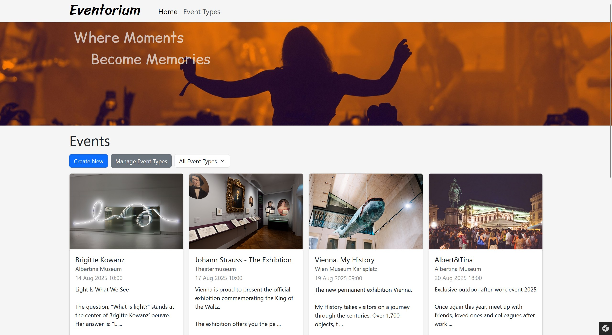
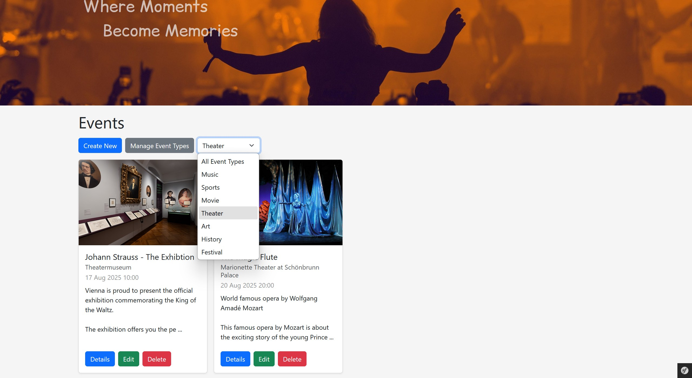
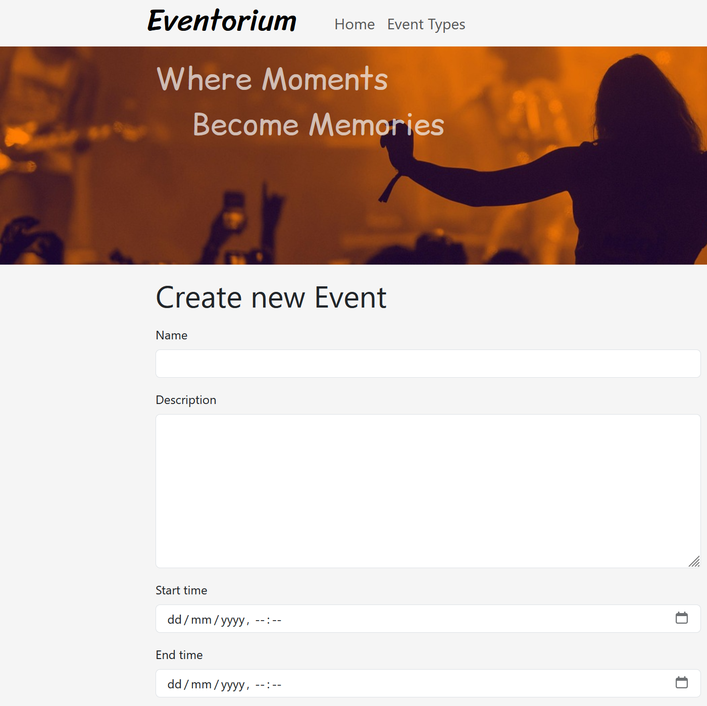
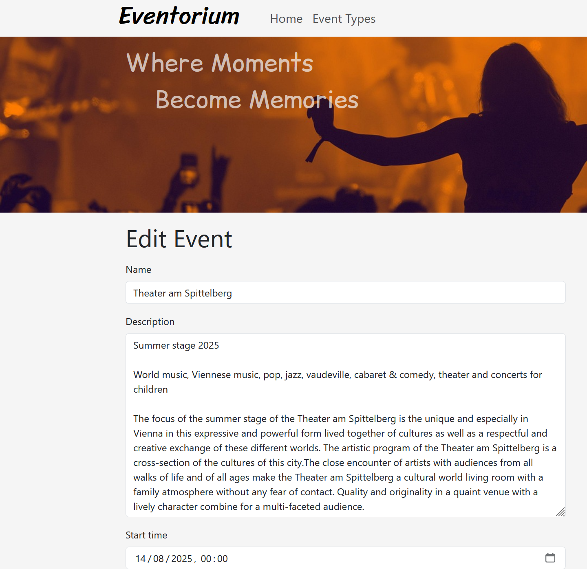
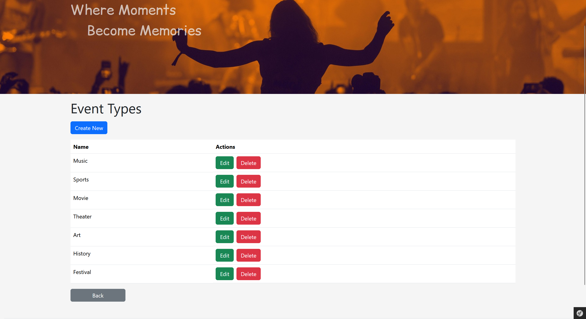

# Eventorium

A web app built with Symfony (PHP Framework) to manage events.

## Features

- List of events with cover images and details
- Add, edit, delete, and view details of events
- Filter events by type/category
- Simple, clean interface using Bootstrap

## Screenshots

<table>
  <tr>
    <td colspan="2">
      
    </td>
  </tr>
  <tr>
    <td colspan="2">
      
    </td>
  </tr>
  <tr>
    <td colspan="2">
      
    </td>
  </tr>
  <tr>
    <td colspan="2">
      
    </td>
  </tr>
  <tr>
    <td>
      
    </td>
    <td>
      
    </td>
  </tr>
  <tr>
    <td colspan="2">
      
    </td>
  </tr>
</table>
